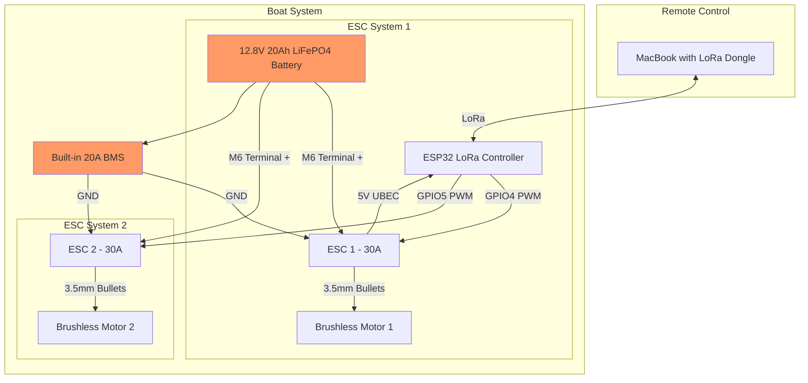
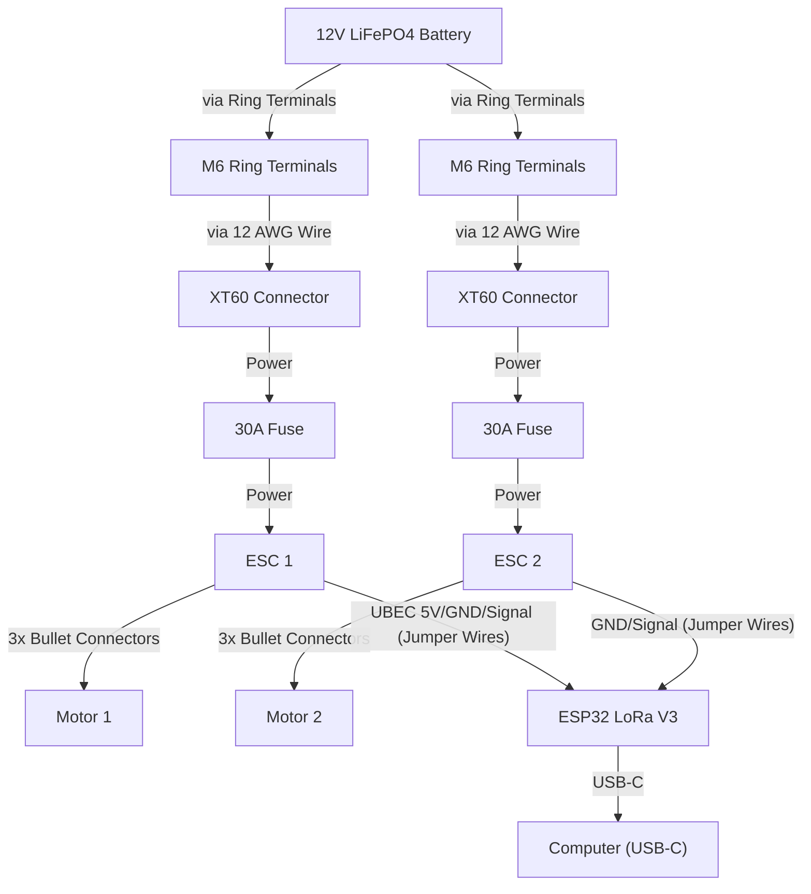

## ⚙️ Design Principles

- **Simplicity First**: Favor simple solutions over complex ones. Avoid unnecessary subsystems.
- **Time to build should be fast**: Favor simplicity also to optimize for time to build this out.
- **Reliable Commodity Parts**: Choose widely available, well-supported components with a track record of durability.
- **Cost Conscious**: Keep the overall cost low; consider creative materials (e.g. PVC pontoons for the hull).
- **Software-Leveraged**: Where possible, use software to reduce hardware complexity. Custom code is preferred over over-engineered hardware solutions.
- **Engineer-Friendly**: The project should be approachable and debuggable for a generalist software engineer comfortable in Python, Node.js, or similar.

## 🛥️ Self-Guided RC Boat — Requirements

### 1. Mission
- Autonomously travel a predefined GPS route of up to 10 miles
- Furthest point will be 5 miles away. From where I will be on the lake, at some points land that's up to 100ft in elevation off the surface of the lake will be in the way.
- No need for obstacle avoidance or real-time course corrections beyond GPS navigation
- Failsafe behavior - stop if GPS lost
- it will operate on a lake that's about 7mi long overall and has some islands
- max budget should be $100
- LATER possible additions - it should be possible to add a camera later if I decided to

### 2. Navigation
- Follow a sequence of GPS waypoints
- Maintain reasonable heading accuracy between points
- Basic manual operation should be possible when i'm in close proximity (can be sloppy - only for simple testing)
- There should be basic high latency communication between me and the boat - e.g. 30s ping of gps and battery level back to me
- Within 5m of waypoint is acceptable

### 3. Propulsion
- Use two independent motors for differential thrust steering
- Maintain consistent forward motion over long distance

### 4. Power
- Carry onboard power sufficient for at least 5 miles of operation
- Support for multi-hour continuous runtime

### 5. Telemetry (Optional)
- Low-bandwidth, long-range (≥10 miles) connection for:
  - Location updates
  - Basic system health (e.g. battery level)
  - Simple remote commands (e.g. stop/return)

### 6. Form Factor
- Parts of hull(s) or electronics enclosure, or other parts may be be custom 3D printed
- Compact, water-resistant design suitable for flatwater environments

### System Architecture

# Parts

### Motor (will have two which will allow for steering)
- **Model**: DNYSYSJ Brushless Motor Underwater Thruster
- **Link**: [Amazon Link](https://www.amazon.com/DNYSYSJ-Brushless-Underwater-Thruster-Propeller/dp/B0B3J4CM9H/)
- **Specifications**:
  - Voltage: 12V-24V
  - Power: 30-200W
  - KV Rating: 600KV
  - Material: 304 Stainless Steel Bearing + Aluminum Alloy
  - Propeller: 4-Blade Nylon, 60mm diameter
  - Total Length: 75mm
  - Price: $20.00 each (need 2)

### Electronic Speed Controller (ESC)
- **Model**: 30A RC Brushless Motor Electric Speed Controller ESC (Multi-Directional)
- **Link**: [Amazon Link](https://www.amazon.com/RC-Brushless-Electric-Controller-bullet/dp/B0C5RYKSV2/)
- **Specifications**:
  - Current Rating: 30A
  - UBEC: 5V/3A
  - Input Voltage: LiPo 2-4s (6.4V - 16.8V)
  - Connectors: Pre-soldered XT60 & 3.5mm bullet plugs
  - Features: 
    - Bi-directional control
    - Low Battery Protection
    - Overheat Protection
    - Signal Loss Protection
    - Programmable
  - Price: $18.99 each (need 2)

### Controller
- **Model**: Wishiot ESP32 LoRa V3 Development Board
- **Link**: [Amazon Link](https://www.amazon.com/dp/B0D2DBRR6T)
- **Specifications**:
  - Microcontroller: ESP32-S3FN8 with dual-core Xtensa LX7 architecture
  - CPU Speed: Up to 240 MHz
  - RAM: 512 KB
  - Flash Memory: 8 MB
  - Connectivity: WiFi, LoRa, and BLE
  - Display: 0.96-inch OLED
  - Price: $24.98

### Battery
- **Model**: GOLDENMATE 12V 20Ah LiFePO4 Battery
- **Link**: [Amazon Link](https://www.amazon.com/dp/B0C...)
- **Specifications**:
  - Voltage: 12.8V
  - Capacity: 20Ah (256Wh)
  - Chemistry: LiFePO4 (Lithium Iron Phosphate)
  - Cycle Life: 5000+ cycles
  - Waterproof Rating: IP67
  - Built-in BMS: 20A protection
  - Max Continuous Discharge: 10A
  - Max Charging Current: 10A
  - Weight: 5.95 lbs
  - Dimensions: 2.99"D x 7.13"W x 6.61"H
  - Terminals: M6
  - Price: $69.99

### Connectors and Waterproofing Components

Option 1 - Individual Components (Total: $71-89):
| Component | Specifications | Purpose | Quantity | Est. Price |
|-----------|---------------|----------|----------|------------|
| M6 Ring Terminals | Marine-grade, tinned copper with adhesive heat shrink | Battery power connections | 4 pcs | $8-10 |
| 12 AWG Marine Wire | Tinned copper, red/black, marine-grade | Power distribution | 6 ft each | $12-15 |
| 3.5mm Bullet Connectors | Gold plated, with heat shrink | Motor connections | 6 pairs | $8-10 |
| IP67 Toggle Switch | 20A rated, panel mount, marine-grade | Main power control | 1 pc | $10-12 |
| Cable Glands | IP67 rated, various sizes | Hull penetration sealing | 4 pcs | $8-10 |
| Wire Loom Kit | Marine split-type, UV resistant | Wire protection | 6 ft | $6-8 |
| Silicone Sealant | Marine-grade, clear | Additional waterproofing | 1 tube | $6-8 |
| Dielectric Grease | Waterproof, non-conductive | Connection protection | 1 tube | $5-6 |
| Heat Shrink Tubing | Marine-grade, adhesive-lined, various sizes | Connection sealing | 1 kit | $8-10 |

Option 2 - Cost-Optimized Combo Kits (Total: $45-55):
1. Marine Connection Kit ($25-30):
   - 120pc Waterproof Heat Shrink Connectors
   - Includes ring terminals, butt connectors
   - Marine-grade with adhesive lining
   - Crimping tool included

2. Essential Waterproofing Kit ($20-25):
   - Marine-grade wire (12 AWG, 10ft total)
   - IP67 toggle switch
   - Cable glands (4pc)
   - Dielectric grease
   - Marine silicone sealant

Notes:
- All connections should use marine-grade components with proper waterproofing
- Heat shrink should be applied over all connections
- Dielectric grease should be used in all electrical connections
- Cable glands should be used wherever wires penetrate the hull
- Create drip loops in wiring to prevent water tracking
- Double-seal critical connections with both heat shrink and silicone

### 🧵 3D Printing Material: PETG
The hull and any custom 3D-printed parts will be printed using **PETG** filament. After considering PLA, PETG, and other options, PETG was chosen for the following reasons:
- It is **water-resistant** and won’t degrade with prolonged lake exposure.
- It is more **heat-resistant** than PLA, making it suitable for outdoor use.
- It provides a good balance between **durability and printability**, especially for impact-prone areas like the hull.
- The Anycubic Kobra Max supports PETG well with minimal tuning.

**Recommended PETG Print Settings (starting point):**
- **Nozzle Temp**: 230–250°C  
- **Bed Temp**: 70–85°C  
- **Print Speed**: 40–60 mm/s  
- **Cooling**: 20–50%, or off for better layer adhesion  
- **Adhesion**: Use glue stick or PEI bed surface

## Milestone 1: Desk Test (Battery, Controller, ESCs, Motors)

This milestone verifies basic motor control using the ESP32 controller powered by the battery.

### Ingredients (Minimal Parts Required)

**Core Components:**
*   GOLDENMATE 12V 20Ah LiFePO4 Battery (1x)
*   Wishiot ESP32 LoRa V3 Development Board (1x)
*   30A RC Brushless Motor ESC (2x)
*   DNYSYSJ Brushless Motor Underwater Thruster (2x)

**Connection Components:**
*   M6 Ring Terminals (2x)
*   XT60 Female Connectors (2x)
*   12 AWG Wire (Red & Black, ~1 foot each)
*   Female-to-Female Jumper Wires (~6 pcs)
*   USB-C Cable (for programming/powering ESP32 initially)

**Tools:**
*   Soldering Iron & Solder
*   Wire Stripper/Cutter
*   Screwdriver/Wrench for M6 terminals
*   Computer with Arduino IDE or PlatformIO configured for ESP32

### Steps (Desk Assembly Recipe)

**Safety First:** Disconnect the battery whenever making connections. Be cautious when motors are armed.

1.  **Prepare Battery Connections:**
    *   Cut two ~6-inch lengths of 12 AWG Red wire and two of Black wire.
    *   Solder one end of a Red wire to the positive (+) pin of an XT60 Female connector. Solder one end of a Black wire to the negative (-) pin.
    *   Crimp or solder an M6 Ring Terminal onto the other end of the Red wire.
    *   Repeat step 1.2 and 1.3 for the second XT60 connector and the remaining Red/Black wires and ring terminal.
2.  **Connect ESCs to Power:**
    *   Attach the Red wire's ring terminal to the battery's positive (+) M6 post.
    *   Attach the Black wire's ring terminal to the battery's negative (-) M6 post.
    *   Plug the XT60 connectors into the power input of each ESC.
3.  **Connect Motors to ESCs:**
    *   Plug the three bullet connectors from Motor 1 into the three motor output connectors on ESC 1. Order doesn't matter initially (can be swapped later if motor spins backward).
    *   Repeat for Motor 2 and ESC 2.
4.  **Connect ONE ESC's UBEC to ESP32:**
    *   Identify the 3-pin servo connector coming from ESC 1 (Signal, 5V, GND).
    *   Using jumper wires, connect:
        *   ESC 1 **GND** pin (Black/Brown) --> ESP32 **GND** pin.
        *   ESC 1 **5V** pin (Red) --> ESP32 **5V** pin.
    *   **IMPORTANT:** For ESC 2, connect **ONLY** the **GND** pin (Black/Brown) to another ESP32 **GND** pin. **DO NOT connect the 5V (Red) wire from ESC 2 to the ESP32.**
5.  **Connect ESC Signal Wires to ESP32:**
    *   Using jumper wires, connect:
        *   ESC 1 **Signal** pin (White/Yellow) --> ESP32 **GPIO4** pin.
        *   ESC 2 **Signal** pin (White/Yellow) --> ESP32 **GPIO5** pin.
6.  **Program and Test:**
    *   Connect the ESP32 to your computer via USB-C.
    *   Upload a simple test sketch (e.g., using the Arduino `ESP32Servo` library) to send PWM signals to GPIO4 and GPIO5.
    *   Start with low PWM values to test motor spin direction and basic control.
    *   You can initially power the ESP32 via USB for programming, then disconnect USB and power it solely from the ESC 1 UBEC for a full test (once the battery is connected).

**Next Steps:** Once basic motor control is verified, proceed to LoRa communication setup and more advanced control logic.

