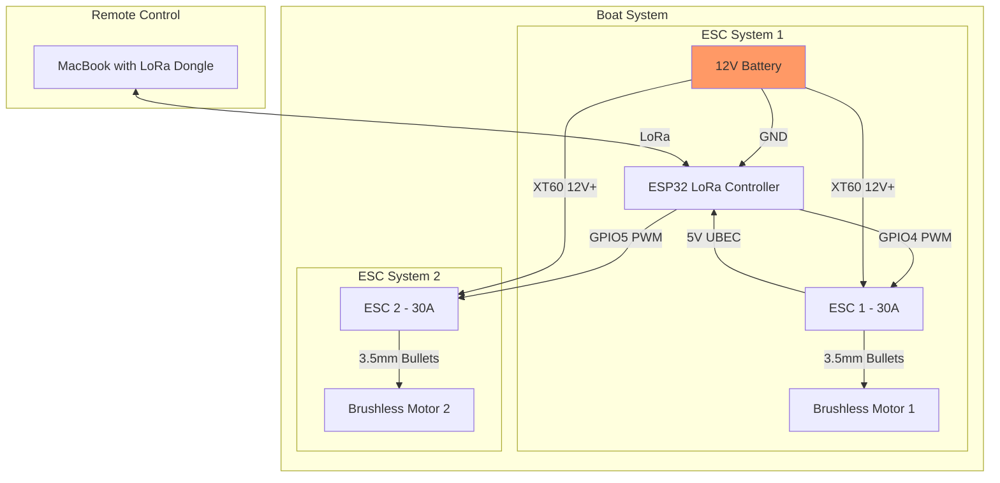

## ⚙️ Design Principles

- **Simplicity First**: Favor simple solutions over complex ones. Avoid unnecessary subsystems.
- **Time to build should be fast**: Favor simplicity also to optimize for time to build this out.
- **Reliable Commodity Parts**: Choose widely available, well-supported components with a track record of durability.
- **Cost Conscious**: Keep the overall cost low; consider creative materials (e.g. PVC pontoons for the hull).
- **Software-Leveraged**: Where possible, use software to reduce hardware complexity. Custom code is preferred over over-engineered hardware solutions.
- **Engineer-Friendly**: The project should be approachable and debuggable for a generalist software engineer comfortable in Python, Node.js, or similar.

## 🛥️ Self-Guided RC Boat — Requirements

### 1. Mission
- Autonomously travel a predefined GPS route of up to 10 miles
- Furthest point will be 5 miles away. From where I will be on the lake, at some points land that's up to 100ft in elevation off the surface of the lake will be in the way.
- No need for obstacle avoidance or real-time course corrections beyond GPS navigation
- Failsafe behavior - stop if GPS lost
- it will operate on a lake that's about 7mi long overall and has some islands
- max budget should be $100
- LATER possible additions - it should be possible to add a camera later if I decided to

### 2. Navigation
- Follow a sequence of GPS waypoints
- Maintain reasonable heading accuracy between points
- Basic manual operation should be possible when i'm in close proximity (can be sloppy - only for simple testing)
- There should be basic high latency communication between me and the boat - e.g. 30s ping of gps and battery level back to me
- Within 5m of waypoint is acceptable

### 3. Propulsion
- Use two independent motors for differential thrust steering
- Maintain consistent forward motion over long distance

### 4. Power
- Carry onboard power sufficient for at least 5 miles of operation
- Support for multi-hour continuous runtime

### 5. Telemetry (Optional)
- Low-bandwidth, long-range (≥10 miles) connection for:
  - Location updates
  - Basic system health (e.g. battery level)
  - Simple remote commands (e.g. stop/return)

### 6. Form Factor
- Parts of hull(s) or electronics enclosure, or other parts may be be custom 3D printed
- Compact, water-resistant design suitable for flatwater environments

# Parts that we'll work from

### Motor (will have two which will allow for steering)
- **Model**: DNYSYSJ Brushless Motor Underwater Thruster
- **Link**: [Amazon Link](https://www.amazon.com/DNYSYSJ-Brushless-Underwater-Thruster-Propeller/dp/B0B3J4CM9H/)
- **Specifications**:
  - Voltage: 12V-24V
  - Power: 30-200W
  - KV Rating: 600KV
  - Material: 304 Stainless Steel Bearing + Aluminum Alloy
  - Propeller: 4-Blade Nylon, 60mm diameter
  - Total Length: 75mm
  - Price: $20.00 each (need 2)

### Electronic Speed Controller (ESC)
- **Model**: 30A RC Brushless Motor Electric Speed Controller ESC (Multi-Directional)
- **Link**: [Amazon Link](https://www.amazon.com/RC-Brushless-Electric-Controller-bullet/dp/B0C5RYKSV2/)
- **Specifications**:
  - Current Rating: 30A
  - UBEC: 5V/3A
  - Input Voltage: LiPo 2-4s (6.4V - 16.8V)
  - Connectors: Pre-soldered XT60 & 3.5mm bullet plugs
  - Features: 
    - Bi-directional control
    - Low Battery Protection
    - Overheat Protection
    - Signal Loss Protection
    - Programmable
  - Price: $18.99 each (need 2)

### Controller
- **Model**: Wishiot ESP32 LoRa V3 Development Board
- **Link**: [Amazon Link](https://www.amazon.com/dp/B0D2DBRR6T)
- **Specifications**:
  - Microcontroller: ESP32-S3FN8 with dual-core Xtensa LX7 architecture
  - CPU Speed: Up to 240 MHz
  - RAM: 512 KB
  - Flash Memory: 8 MB
  - Connectivity: WiFi, LoRa, and BLE
  - Display: 0.96-inch OLED
  - Price: $24.98

### System Architecture
